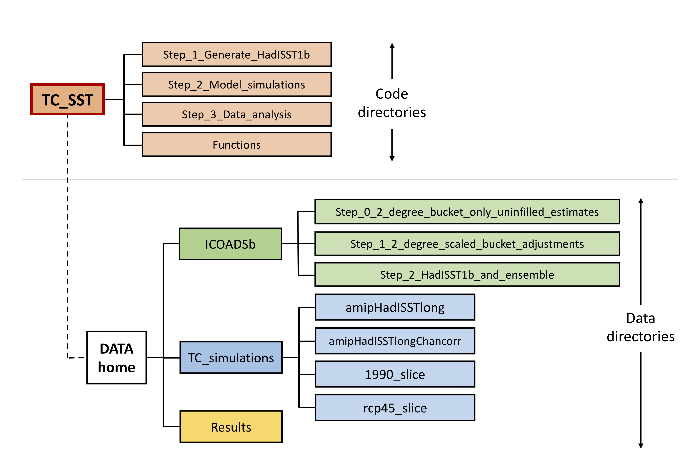

# Correcting 19th and 20th-century sea surface temperatures improves simulations of Atlantic hurricane activity

<br>


Matlab and Fortran scripts associated with the paper "Correcting 19th and 20th-century sea surface temperatures improves simulations of Atlantic hurricane activity" by Duo Chan, Gabriel A. Vecchi, Wenchang Yang, and Peter Huybers.

Most of these codes are [Matlab](https://www.mathworks.com/products/matlab.html).m files.  We provide a script [here](Main.m) for quick reproduction of our results starting from HadISST1b sea surface temperature estimates and tracked cyclones in GFDL-HiRAM simulations.  These results include all statistics, figures, and tables in the main text and supplements.  With all data and metadata downloaded, this step can be finished within 5 minutes on a 2019 version of MacBook Pro with 2.8GHz Intel Core i7 CPUs and 16GB 2133 MHz LPDDR3 memory.  

If you intend to reproduce the full analysis, which includes generating the HadISST1b ensemble and running AMIP simulations using GFDL-HiRAM, please find more details in [later sections](#full-analysis) of this page.  

If you have issues implementing the above scripts or identify any deficiencies, please contact Duo Chan (duochan@g.harvard.edu).

<br>

## Table of contents
 * [Get started](#get-started)  
 * [Quick reproduction of Figures and Tables](#quick-reproduction-of-figures-and-tables)
 * [Full analysis](#full-analysis)
   * [A. Generating HadISST1b](#a-generating-HadISST1b)
   * [B. Hurricane permitting simulations using GFDL-HiRAM](#b-hurricane-permitting-simulations-using-gfdl-hiram)

<br>

## Get started

[<span style="color:gray">Back to Table of contents</span>](#table-of-contents)

Run [TC_SST_init.m](TC_SST_init.m) to initialize the analysis.  This script will add all codes in this package to the Matlab path and set up directories structured following the below figure.  The default path will be the directory of this package; so please make sure around 15GB of disk space is available, or, specify another directory to store the data using ```$DATA_home```:

```
TC_SST_init($DATA_home)
```



<br>

## Quick reproduction of results

[<span style="color:gray">Back to Table of contents</span>](#table-of-contents)

After initialization, run [TC_SST_Main.m](TC_SST_Main.m), a wrapper that downloads [data](https://dataverse.harvard.edu/api/access/datafile/3424404) and generates statistics, figures, and tables in the main text and supplements.  

```
TC_SST_Main
```

Data that are downloaded include HadISST1, central estimates of HadISST1b, a 20-member ensemble of HadISST1b with randomized groupwise corrections, tracked cyclones in HiRAM simulations, and observed Atlantic hurricane count estimates.    

Dependency is the __Matlab [m_map](https://www.eoas.ubc.ca/~rich/map.html) toolbox__ and we put a copy in this package.

<br>
<br>
________________________________


## Full analysis
[<span style="color:gray">Back to Table of contents</span>](#table-of-contents)

We provide the following guidance for users interested in reproducing our full analysis.

### A. Generating HadISST1b
[<span style="color:gray">Back to Table of contents</span>](#table-of-contents)

The generation of HadISST1b requires merging [groupwise bucket corrections](https://www.nature.com/articles/s41586-019-1349-2) to the [HadISST](https://www.metoffice.gov.uk/hadobs/hadisst/) dataset.  To start, download groupwise corrected bucket-only SSTs (2-degree resolution, 1.5GB) from [here]() and place them under ```$Data_directory/SSTs/Step_0_2_degree_bucket_only_uninfilled_estimates/```.  Codes for generating these bucket-only estimates can be found [here](https://github.com/duochanatharvard/Homogeneous_early_20th_century_warming).  ICOADS3.0 is also required for counting the percentage of bucket measurements to all SSTs in individual monthly 5-degree boxes, which can be downloaded from [here](https://dataverse.harvard.edu/file.xhtml?persistentId=doi:10.7910/DVN/DXJIGA/KWDPTS&version=2.0) (31.8GB).  In [TC_SST_IO.m](TC_SST_IO.m), the directory in which ICOADS3.0 is stored also needs to be specified.

```
elseif strcmp(input,'ICOADS_raw')
    output = $Directory of ICOADS 3.0;
```  
With data downloaded and directories set, HadISST1b can be generated simply by calling,
```
for en = 0:20
    TC_SST_generate_HadISST1b_step_01_scale_bucket_corrections(en);
    TC_SST_generate_HadISST1b_step_02_merge_with_HadISST1(en);
end

```
It takes around 3.5 hours to finish one ensemble member.


### B. Hurricane permitting simulations using GFDL-HiRAM
[<span style="color:gray">Back to Table of contents</span>](#table-of-contents)
